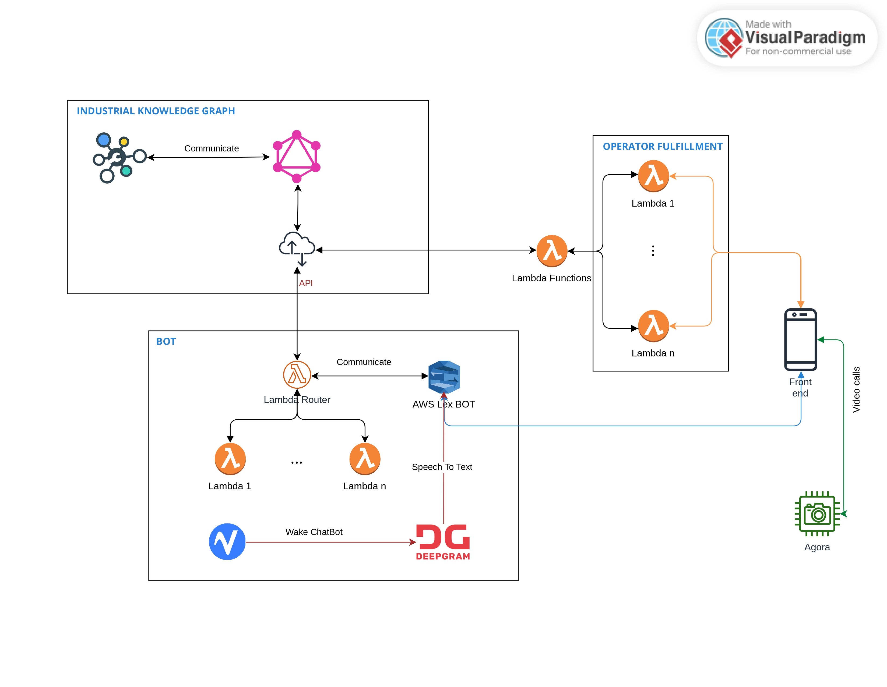

# Smart Assistant

Smart Assistant è un'applicazione sviluppata in Flutter per semplificare le attività di manutenzione e migliorare il controllo e la supervisione delle operazioni nell'ambito della Manutenzione e Industria 4.0.

## Funzionalità

Le principali funzionalità dell'applicazione sono:

-   Scegliere un task da svolgere tra quelli assegnati in ordine di priorità;
-   Visualizzare un riepilogo degli strumenti necessari per svolgere il task selezionato;
-   Identificare un macchinario tramite codice QR;
-   Visualizzare informazioni e documentazioni relative al macchinario selezionato;
-   Interagire con un Chat Bot vocalmente o scrivendogli per ottenere supporto o informazioni aggiuntive;
-   Richiedere aiuto ad un operatore più esperto tramite una funzione di videochiamata.

## UI/UX

L'interfaccia utente dell'applicazione è stata progettata per garantire un'esperienza Tablet-oriented, con un layout in modalità portrait. Sono stati utilizzati font e colori adatti per migliorare la leggibilità delle informazioni. Inoltre, si è cercato di minimizzare il numero di tap necessari per l'utilizzo dell'applicazione.

## Tecnologie utilizzate

Smart Assistant utilizza diverse tecnologie per garantire il corretto funzionamento delle sue funzionalità:

-   Flutter: il framework di sviluppo per la realizzazione dell'applicazione;
-   Knowledge Graph: una tecnologia di back-end utilizzata per estrarre le conoscenze necessarie per svolgere le attività di manutenzione;
-   Agora: una piattaforma di comunicazione in tempo reale utilizzata per la parte di videochiamata;
-   Firebase: una tecnologia di cloud storage utilizzata per lo storing dei dati relativi all'applicazione;
-   AWS Lambda: una tecnologia di elaborazione serverless utilizzata per il retrieve delle informazioni dal Knowledge Graph;
-   AWS Lex: una tecnologia di elaborazione del linguaggio naturale utilizzata per la realizzazione del Chatbot;
-   PicoVoice e Deepgram: tecnologie utilizzate per il controllo vocale del Chatbot, implementando una wakeword e un sistema di speech to text.

##	Struttura Cartelle

 

 - `smart_assistant` contiene tutti i file necessari a per avviare il progetto in Flutter
 - `Diagrammi` contiene tutti gli UCD e CD
 - `customPackages` contiene pacchetti custom utilizzati per l'app
 - `Documentazione` contiene RAD, Business Canvas Model e le presentazioni PowerPoint per l'app
